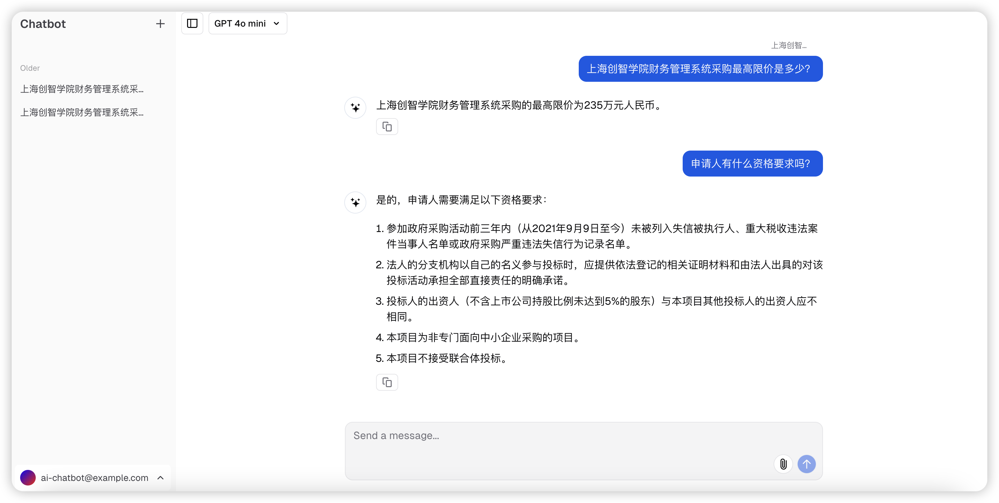
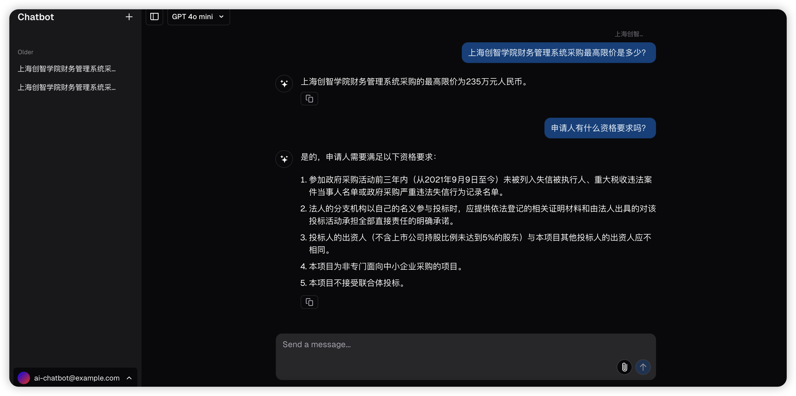

Author: 徐艳

# AI Chatbot

AI Chatbot 是一个智能对话机器人，包含以下两个核心组件：
- **chatbot-ui**：前端项目，基于 React 开发，使用 TypeScript 编写。
- **chatbot-server**：后端项目，基于 FastAPI 开发，使用 Python 3 编写。

## 开发环境
- **Node.js**: v22.12.0
- **Python**: 3.11
- **Java**: >= 11（仅用于 OpenAPI 客户端生成）

## API 客户端生成

在前端项目中生成 API 客户端代码：
```bash
cd chatbot-ui
npx @openapitools/openapi-generator-cli generate -i ../docs/openapi.json -o ./lib/generated -g typescript-axios
```

## 前端开发

安装依赖并启动前端服务：
```bash
cd chatbot-ui
pnpm install
pnpm dev
```

前端服务地址：[http://127.0.0.1:3000](http://127.0.0.1:3000)

## 后端开发

安装依赖并启动后端服务：
```bash
cd chatbot-server
poetry shell
poetry install
poetry run python main.py 
```

后端服务地址：[http://127.0.0.1:8000](http://127.0.0.1:8000)

## API 文档

### 在线文档
- Swagger 文档：[http://127.0.0.1:8000/docs](http://127.0.0.1:8000/docs)
- OpenAPI JSON：[http://127.0.0.1:8000/openapi.json](http://127.0.0.1:8000/openapi.json)

### 离线文档
- 文件路径：`./docs/openapi.json`

## 部署

### Docker Compose

```
docker compse -f deployment/docker-compose.yaml up -d
```

### Kubernetes

```
helm upgrade --install deployment/helm/ai-chatbot
```

## 系统截图


